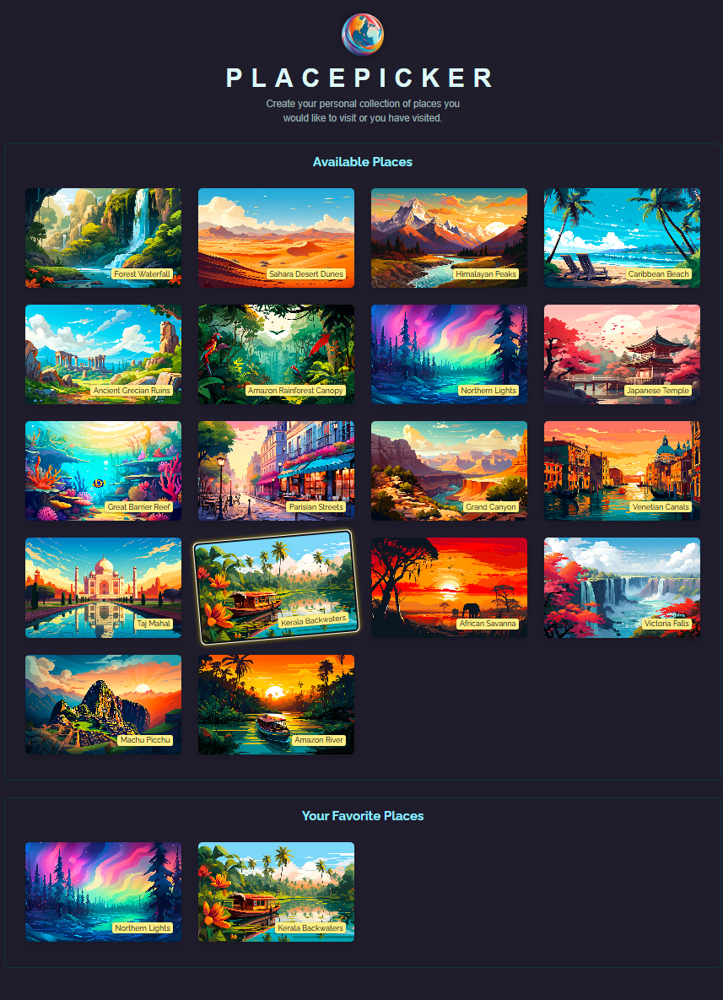

  

  

## 📝 Overview
**Placepicker** is a small Angular demo built while following an Angular course. It showcases how to fetch and display places via HTTP.
 
+### CLI Commands
- `npm start` - in backend folder to start node server.
- `ng serve` – dev server at [http://localhost:4200/](http://localhost:4200/) with live reload (client).
- `ng generate <schematic>` – scaffold components, directives, pipes, etc.
- `ng build` – create a production build in the `dist/` folder.
- `ng test` – execute unit tests with Karma.
- `ng e2e` – run end-to-end tests (after adding a testing package).
- `ng help` – more Angular CLI commands and details.

This project was generated with [Angular CLI](https://github.com/angular/angular-cli) version 18.0.0.

  

